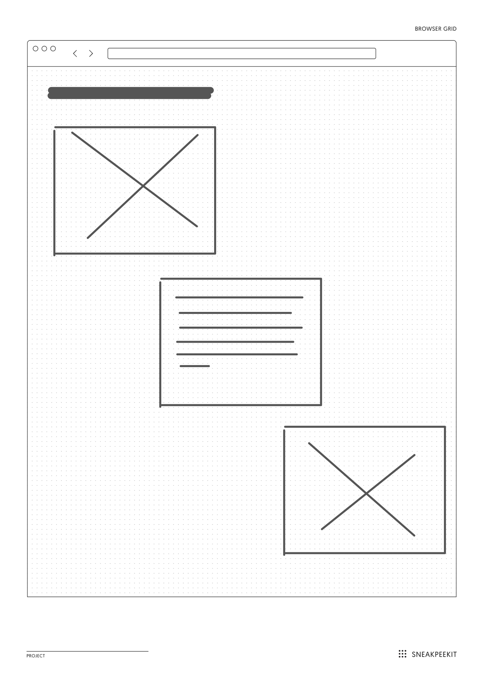
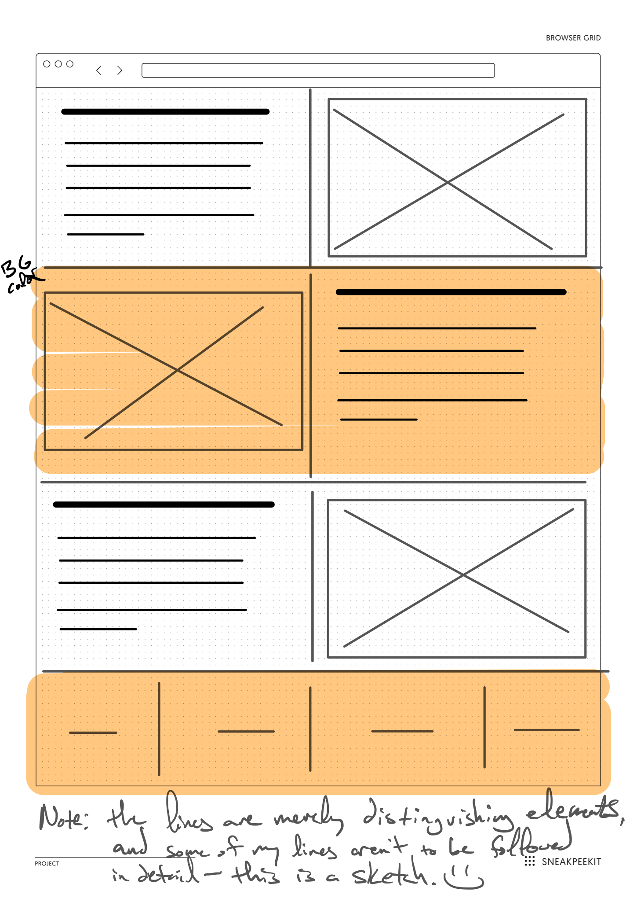

# Flexing Your 1-Dimensional Alignment Skills with Flexbox (`display: flex;`)

## Goal

Flexing your flexbox alignment skills to create some basic layouts.

Follow this procedure to setup your coding folder:

1. Within this root folder, create a new folder with the name: `lastname-flex`.
   - **NOTE** `lastname` is your last name. Mine would be: `lindgren-flex`.
2. Inside the root of *your personal coding folder*, create the following files: `align.html` and `scheme.html`.
3. Again, inside the root of *your personal coding folder*, create an `assets` folder.
4. Inside `assets`, create a `.keep` file and a `css` folder.
5. Inside `css`, create:
   1. `align.css` to link to `align.html`.
   2. `scheme.css` to link to `scheme.html`.
6. ※\(^o^)/※ Start writing some code! ※\(^o^)/※

## Other Considerations

- Practice designing these sites with the **MOZILLA FIREFOX** browser's inspection tool. It has a more robust inspector than Chrome. However, Chrome now has a flex and grid inspectioon tool, if you have a more recent version.
- If you'd like to spice it up with your  own flare, feel free to practice some basic typography and color schemes. 
- You can also use your own images, instead of placeholders. BUT, be sure to create your own images folder in your project, and be mindful of the file sizes, since others will fetch these files too.
- Practice documenting your code and writing your CSS from more general rules to more specific in the HTML source order.
- **NOTE**: I do not mind if you work together with anyone, but you should not write the same code together. Help each other instead.
- **DO NOT** push your code until class time.
- Be sure to submit the assignment link in Canvas.

## 1. Align The Children with Reusable Classes

Line some children items up as seen in the wireframe below:

There are variations on this design scheme, but try to write your HTML and CSS in a way that balances the amount of code necessary to write it, as well as code that is **reusable as possible classes** to reuse across a larger site.

## 2. Flexing Reusable Classes to Create a Design Scheme

Spot the design pattern in the wireframe below, and recreate it with flexbox:

Like drill #1, there are variations on this design scheme, but try to write your HTML and CSS in a way that balances the amount of code necessary to write it, as well as code that is **reusable as possible classes** to reuse across a larger site.